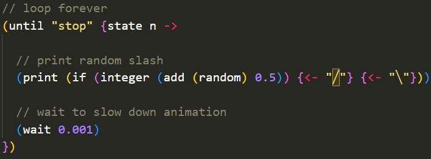
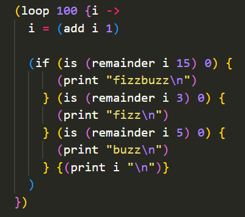

# Crumb Syntax Highlighter for Visual Studio Code
The Visual Studio Code syntax highlighter extension for [Crumb](https://github.com/liam-ilan/crumb). Install the extension [here](https://marketplace.visualstudio.com/items?itemName=liamilan.crumb).

## Examples
|  |  |
|---|---|

## Author
Built by [Liam Ilan](https://www.liamilan.com/).